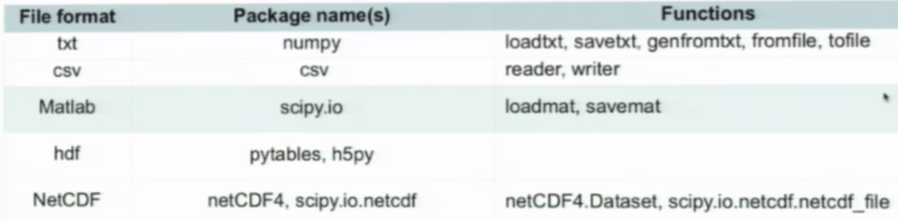
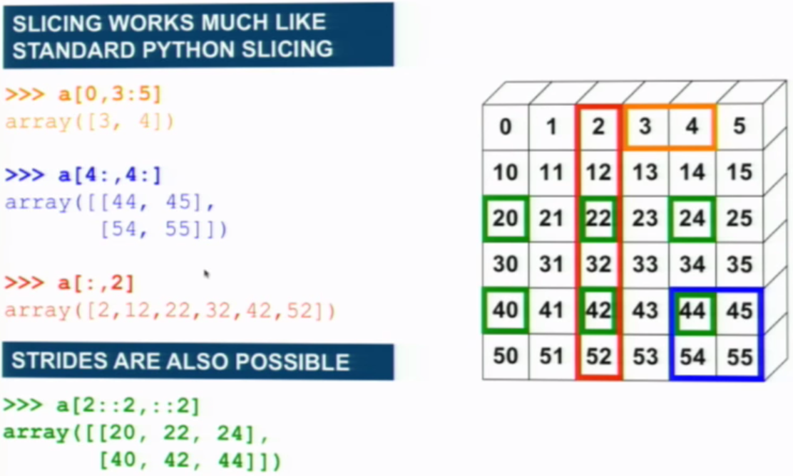
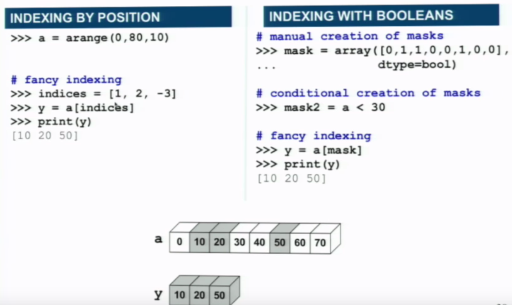

# Contents
 * [Basics](basics.ipynb)
 * [Lists & Tuples](lists_tuples.py)
 * [Conditions & Loops](conditions_loops.py)
 * [Functions](functions.py)
 * [Sets & Dictionaries](sets_dictionaries.py)
 * [Threads](threads.py)
 * [Classes & Inheritance](classes_inheritance.py)
 * [Files](files.py)
 * [Exceptions](exceptions.py)
 * Unit Testing
    * [Testing Functions](unit_testing_functions.py)
    * [Testing Classes](unit_testing_classes.py)
 * Example Programs
    * [File Dowonloader](example_programs/file_downloader.py)
    * [Web Crawler](example_programs/web_crawler.py)
    * [Word Frequency Counter](example_programs/word_freq_counter.py)
 * Libraries
    * [Django](libraries/django/notes.md)
    * [Matplotlib](libraries/matplotlib/matplotlib.py)
    * [Numpy](libraries/numpy/demo.py)

